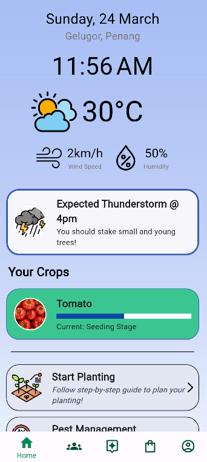
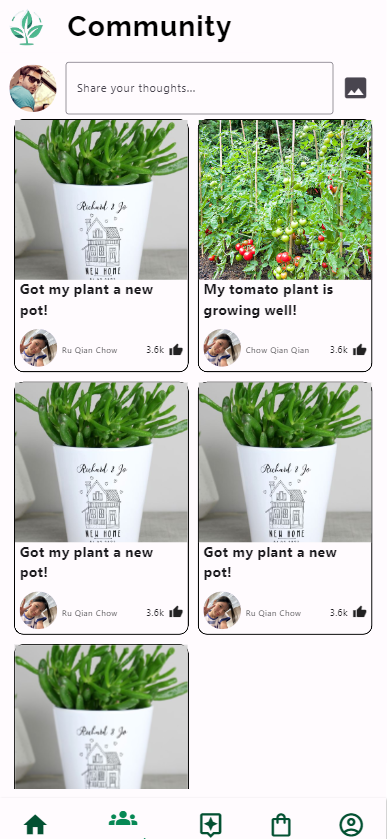
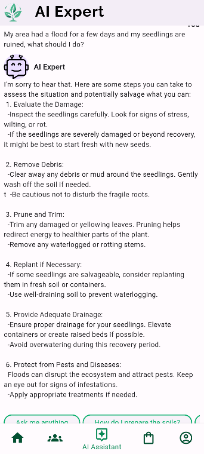
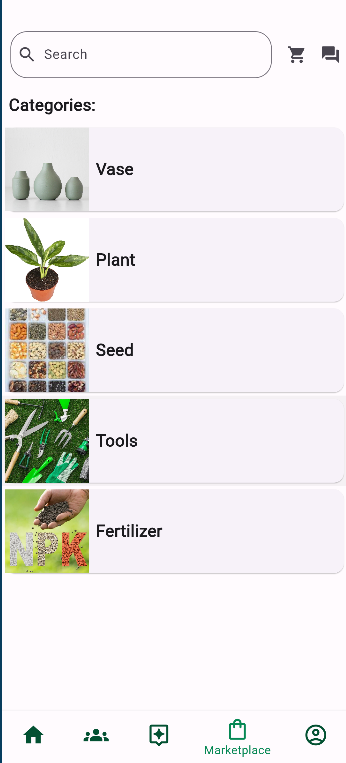
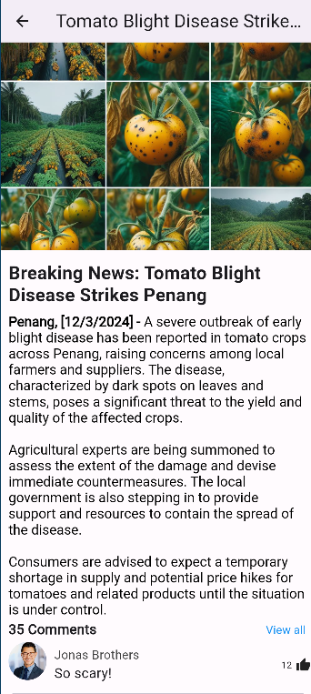
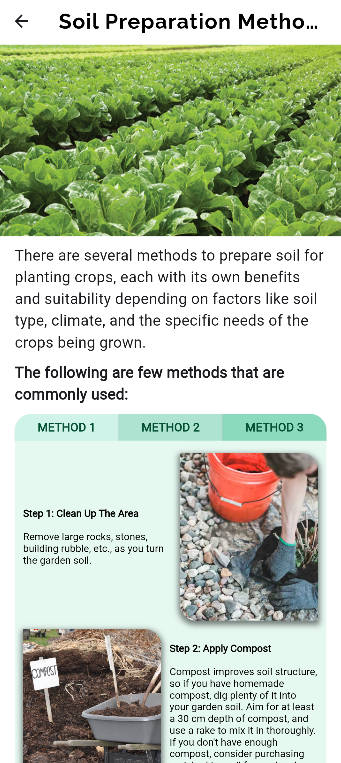
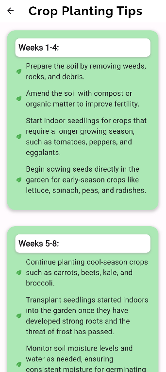

# VHACK2024_FarmerHaven_Manna

In a world where agriculture plays a crucial role in ensuring food security and sustainability, it is imperative to empower novice farmers with effective crop management techniques. Our case study focuses on developing accessible and user-friendly solutions for individuals with limited knowledge and experience in crop cultivation.

Our proposed solution encompasses the following key features:
1. Soil preparation
2. Pest management
3. Resource allocation
4. Crop health monitoring
5. Weather condition monitoring
6. Pest outbreak notifications
7. Step-by-step guides
8. AI-assistant integration
9. E-commerce system
10. Community engagement functionality

### Requirement:
-Flutter
### Installation:
```bash
git clone https://github.com/Jisi-A/manna_vhack2024
cd manna_vhack2024
```
```bash
flutter run
```
### Screenshots:
1. Home



2. Community



3. AI Expert



4. Marketplace



5. Alerts



6. Soil Preperation



7. Planting Guidelines



### Business Model:
-Revenue Streams
Taking a portion of the price listed for products and the booking of professionals

-Target Market
Farmers, agricultural professionals, hobbyists, and anyone involved or interested in crop management

-Value Proposition
Integrates pest management, soil preparation methods, crop planting tips, crop health analysis, weather updates, news, and community

-Cost structure
Software development, server maintenance, content acquisition, marketing, customer support, and operational expenses

### Contact:
## Contact -
Lai Yicheng -
Lee Ying Shen -
Lim Jia Liang -
Yeo Din Song - [example@gmail.com](dinsong@gmail.com)

Project Link: [https://github.com/your_username_/Project-Name](https://github.com/your_username_/Project-Name)
