# VHACK2024_FarmerHaven_Manna


In a world where agriculture plays a crucial role in ensuring food security and sustainability, it is imperative to empower novice farmers with effective crop management techniques. Our case study focuses on developing accessible and user-friendly solutions for individuals with limited knowledge and experience in crop cultivation.

Our proposed solution encompasses the following key features:
1. Soil preparation
2. Pest management
3. Resource allocation
4. Crop health monitoring
5. Weather condition monitoring
6. Pest outbreak notifications
7. Step-by-step guides
8. AI-assistant integration
9. E-commerce system
10. Community engagement functionality

### Framework:
- Flutter
- Dart SDK
- Android Studio or VS Code
### Installation:
1. Change directory you wish to store the repo
```
cd /your designated directory
```

2. Clone this repository 
```
git clone https://github.com/Jisi-A/manna_vhack2024.git
```

3. If you are using Visual Studio Code, run this to build the app:
```
flutter run -d chrome
``` 

4. It is recommended to use the **Pixel 7** emulator as it has been optimized for the best experience. Other resolutions may not be fully optimized yet.

```bash
git clone https://github.com/Jisi-A/manna_vhack2024
cd manna_vhack2024
```
```bash
flutter run
```
### Screenshots:
1. Home

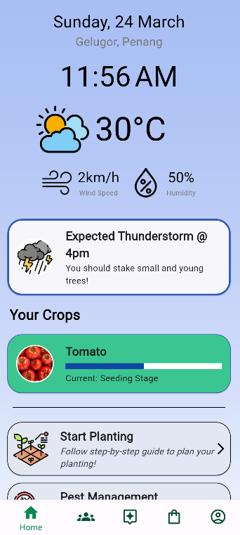

2. Community

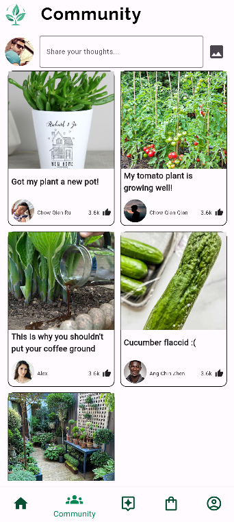

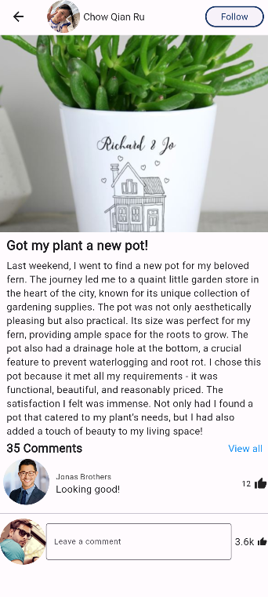

3. AI Expert

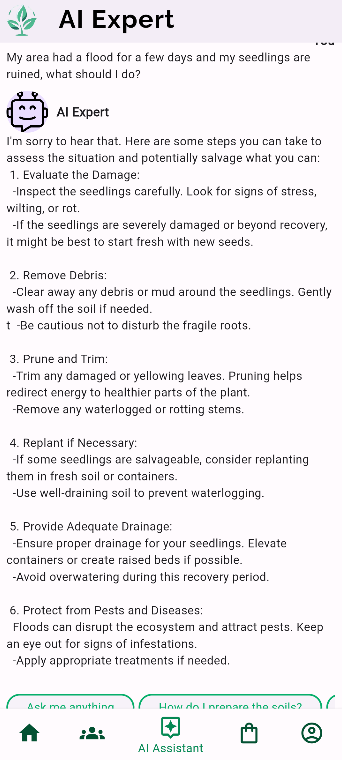

4. Marketplace

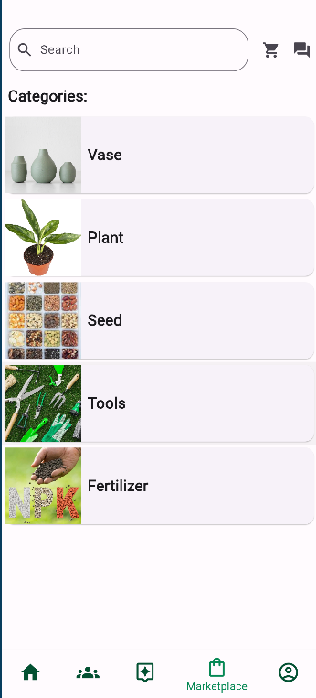

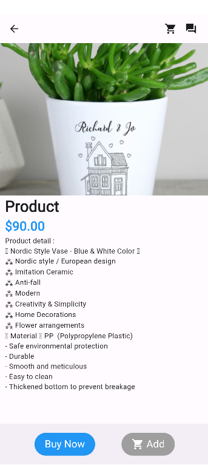

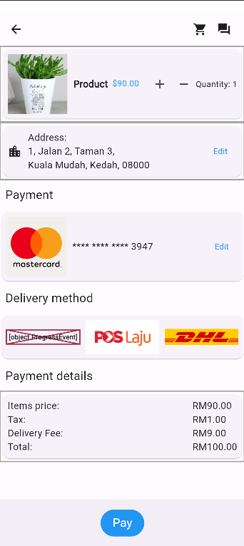

5. Breaking News / Alerts

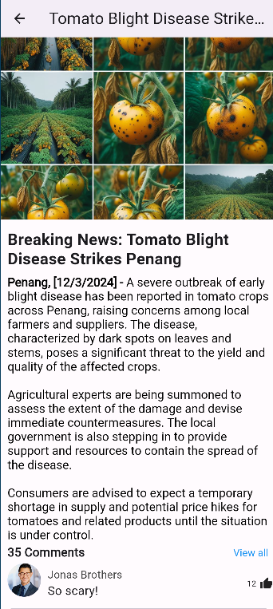

6. Soil Preperation

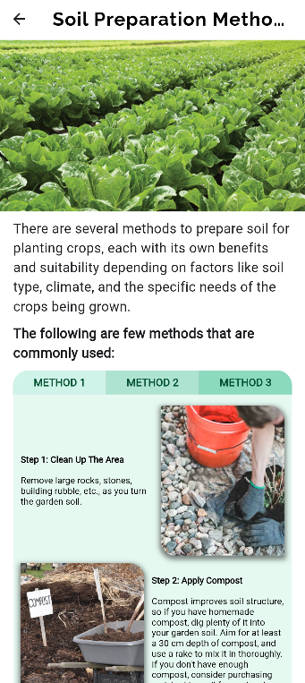

7. Planting Guidelines

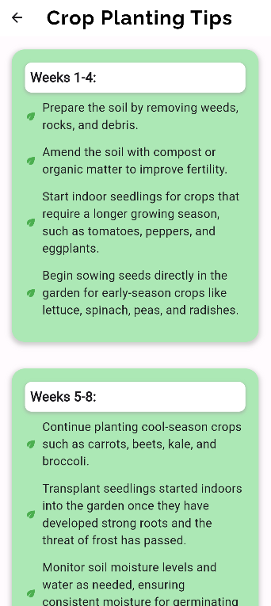

8. Pest Monitoring

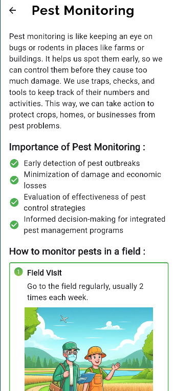

9. Disease Information

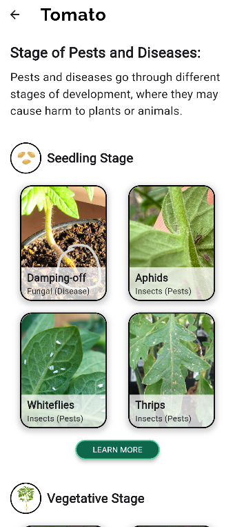

10. Let AI have a look on your plant

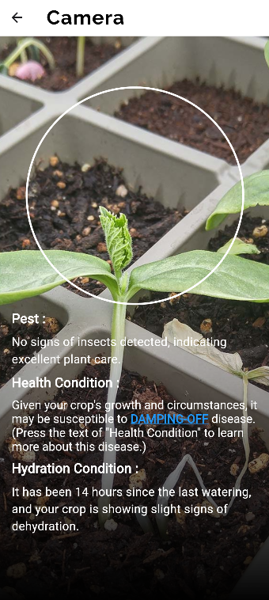

11. Hire a professional

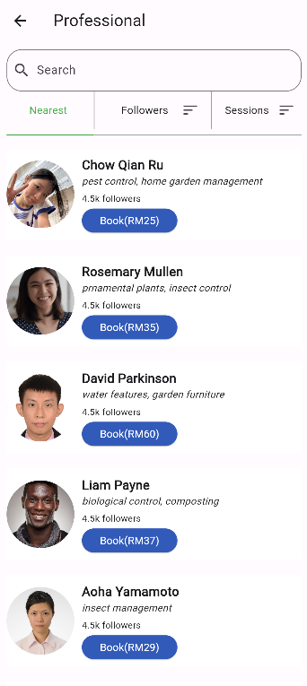

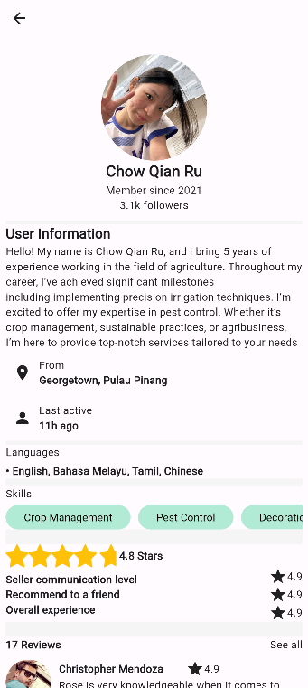

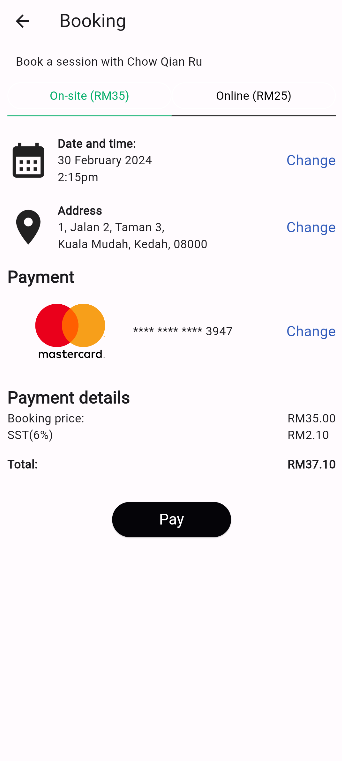

### Business Model:
- Revenue Streams
    - Taking a portion of the price listed for products and the booking of professionals

- Target Market
    - Farmers, agricultural professionals, hobbyists, and anyone involved or interested in crop management

- Value Proposition
    - Integrates pest management, soil preparation methods, crop planting tips, crop health analysis, weather updates, news, and community

- Cost structure
    - Software development, server maintenance, content acquisition, marketing, customer support, and operational expenses


### Contact:

Lai Yicheng -

Lee Ying Shen - [johnaslee97@gmail.com](johnaslee97@gmail.com)

Lim Jia Liang -

Yeo Din Song - [dinsong@gmail.com](dinsong@gmail.com)

Project Link: [https://github.com/Jisi-A/manna_vhack2024](https://github.com/Jisi-A/manna_vhack2024)
